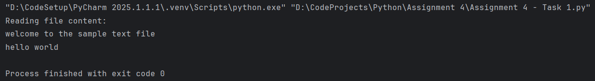
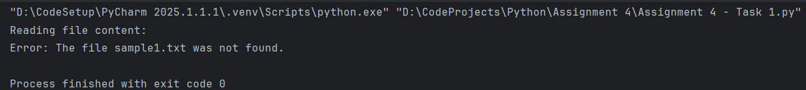

#  Assignment 4 – Module 5 - Files, Exceptions, and Errors in Python

###  **Task 1:** Read a File and Handle Errors
`Assignment 4 - Task 1.py`
-    Problem Statement:
Write a Python program that does the following:
1.   Opens and reads a text file named sample.txt.
2.   Prints its content line by line.
3.   Handles errors gracefully if the file does not exist.
   

###  **Task 2:** Using the Math Module for Calculations
`Assignment 4 - Task 2.py`
-   Problem Statement:
Write a Python program that does the following:
1.   Takes user input and writes it to a file named output.txt.
2.   Appends additional data to the same file.
3.   Reads and displays the final content of the file.

  
