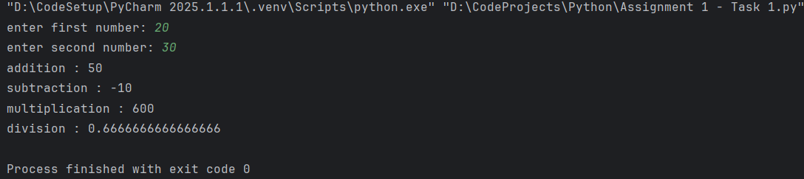
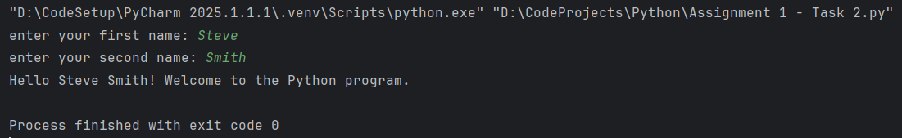

#  Assignment 1 – Module 2 - Basic Python Concepts
This repository contains two simple Python scripts for Assignment 1:

###  **Task 1:** Perform basic mathematical operations
-    Problem Statement:
Write a Python program that does the following:
1. Takes two numbers as input from the user.
2. Performs the basic mathematical operations on these two numbers.
   

###  **Task 2:** Create a personalized greeting message
-   Problem Statement:
Write a Python program that does the following:
1. Takes a user's first name and last name as input.
2. Concatenates the first name and last name into a full name.
3. Prints a personalized greeting message using the full name.
   
  
