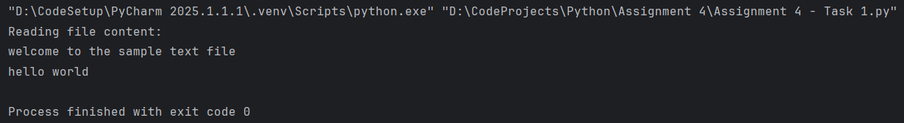
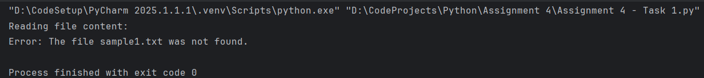
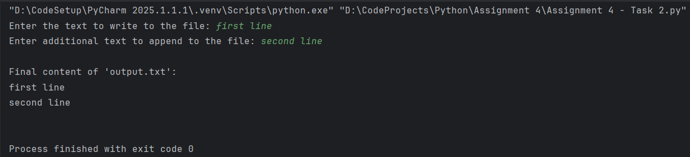

#  Assignment 1 – Module 2 - Basic Python Concepts

###  **Task 1:** Perform basic mathematical operations  
`Assignment 1 - Task 1.py`
-    Problem Statement:
Write a Python program that does the following:
1. Takes two numbers as input from the user.
2. Performs the basic mathematical operations on these two numbers.
   

###  **Task 2:** Create a personalized greeting message 
`Assignment 1 - Task 2.py`
-   Problem Statement:
Write a Python program that does the following:
1. Takes a user's first name and last name as input.
2. Concatenates the first name and last name into a full name.
3. Prints a personalized greeting message using the full name.
   
  

  #  Assignment 2 – Module 3 - Control Structures in Python

###  **Task 1:** Check if a Number is Even or Odd 
`Assignment 2 - Task 1.py`
-    Problem Statement:
Write a Python program that does the following:
1. 	Takes an integer input from the user.
2. 	Checks whether the number is even or odd using an if-else statement.
3. 	Displays the result accordingly.
   

###  **Task 2:** Sum of Integers from 1 to 50 Using a Loop 
`Assignment 2 - Task 2.py`
-   Problem Statement:
Write a Python program that does the following:
1.   Uses a for loop to iterate over numbers from 1 to 50.
2.   Calculates the sum of all integers in this range.
3.   Displays the final sum.

  

  #  Assignment 3 – Module 4 - Functions & Modules in Python

###  **Task 1:** Calculate Factorial Using a Function 
`Assignment 3 - Task 1.py`
-    Problem Statement:
Write a Python program that does the following:
1.   Defines a function named factorial that takes a number as an argument and calculates its factorial using a loop or recursion.
2.   Returns the calculated factorial.
3.   Calls the function with a sample number and prints the output.
   

###  **Task 2:** Using the Math Module for Calculations
`Assignment 3 - Task 2.py`
-   Problem Statement:
Write a Python program that does the following:
1.   Asks the user for a number as input.
2.   Uses the math module to calculate the:
-   Square root of the number
-   Natural logarithm (log base e) of the number
-   Sine of the number (in radians)
3.   Displays the calculated results.

  

#  Assignment 4 – Module 5 - Files, Exceptions, and Errors in Python

###  **Task 1:** Read a File and Handle Errors
`Assignment 4 - Task 1.py`
-    Problem Statement:
Write a Python program that does the following:
1.   Opens and reads a text file named sample.txt.
2.   Prints its content line by line.
3.   Handles errors gracefully if the file does not exist.
   

#### You can check the text file in Output folder 
`Task 1 : sample.txt`

###  **Task 2:** Using the Math Module for Calculations
`Assignment 4 - Task 2.py`
-   Problem Statement:
Write a Python program that does the following:
1.   Takes user input and writes it to a file named output.txt.
2.   Appends additional data to the same file.
3.   Reads and displays the final content of the file.

  
#### You can check the text files in Output folder 
`Task 2 : output.txt`

